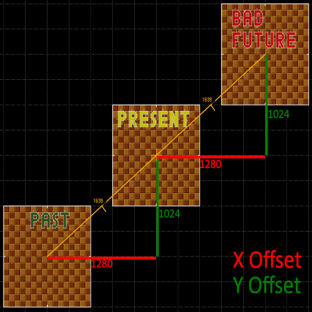
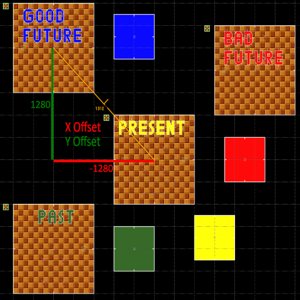

# Mapping documentation for LTM's Murder Mystery `1.0`

In this document we will go through the MM things and mechanics that you can apply in your maps.

## Table of contents
- [Design 101](#design-101)
- [SOC](#soc)
- [Map things](#map-things)
- [Time Travel](#time-travel)

## Design 101
To be honest, there are no strict Design Guidelines you should follow for an MM map. Every single map bundled with the main MM add-on is considered experimental and each is different in some way or another. One thing you should know is that MM is based on Ringslinger game types of SRB2, meaning that maps made for MM should, in some form, be Ringslinger compatible (have Match Player Spawns and (Regular) Rings placed).

It is up to you to decide what you want your MM map to be and what you want to put inside of it. I will go through each main MM map to give an idea of what you can do with your map:

| Map | Map Number | Size | Hiding places? | General shape/layout | Description |
| --- | --- | --- | --- | --- | --- |
| *Abandoned Shelter* | `MAPK0` | Average | Lots of | Indoor, O-shape | Dark map set in an old fallout shelter of Eggman. Has average-size corridors, tiny vents to travel between rooms and practically no verticality (except the Entrance and the Storage Room which are located on a different floor). Contains all SRB2 vanilla Weapon Rings Panels, but no Weapon Rings. Perhaps the best MM map example. Perfectly fits the Tag and Hide&Seek gamet types too. Includes external LUA script for the Eggman Bedroom door manipulation. |
| *Vineyard Castle* | `MAPK1` | Average | Practically none | Outdoor, Square-shape | A map with a big open area. The center of the map is filled with trees, but they can be easily jumped on from the walls on the sides of the map. Has only 5 Weapon Ring Panels placed, which require some parkour and precision to reach. |
| *Peridot Park* | `MAPK2` | Average | Average (depends on your camouflage) | Outdoor, Square-shape | A night park map. The gameplay on this map is based around hiding between the trees and bushes (with the help of the camouflage). One watchtower in the map centre and a small 2-floor house at the corner. Weapon Rings Panels are scattered across the entire map. |
| *Mountain Fort* | `MAPK3` | Huge | Above average (depends on your camouflage) | Outdoor and Indoor | Snowy map with huge outdoor area and Indoor area (Fort). Weapon Ring Panels are scattered across the entire map. Camouflage can be used in the outside area of the map for hiding. |
| *West City* | `MAPK4` | Huge | Lots of | Outdoor | Map set in a wild west theme. Has a long central street where all the action is happening. There are lots of houses to hide in (and do murders). The desert outside of the city can be used for escapes. Weapon Ring Panels and Weapon Rings are scattered across the entire map in different buildings. |
| *Dam* | `MAPK5` | Huge | Average | Outdoor, Linear | First of the "levels from other games" map. This map is copied straight from Goldeneye 007 on Nintendo 64. The map is long, linear and does not have much hiding places. The Dam part of the map is not very linear, but players can die if they fall outside of the map. Weapon Ring Panels are scattered across the map in different structures. |
| *Backrooms* | `MAPK6` | Below average | Practically none | Indoor, Flat Maze | Map designed to be a maze. The first version of the map utilized silent teleporters to give the illusion of the infinite maze. Second version of the map (the current one) got rid of this idea and instead contains pseudo-randomly generated layout. There are no Weapon Ring Panels, only regular Rings to use. Includes external LUA script for the layout generation. |
| *Space Mesa* | `MAPK7` | Above average | Not much | Indoor, Square-shape | Map inspired by UAC space bases from DOOM. The action takes place in the space base on one of the satelines of Mars. The Weapon Ring Panels are scattered across the entire map. |
| *The 8-Ball Hotel* | `MAPK8` | Huge | Below average | Outdoor and Indoor | A hotel map with huge outdoor and indoor areas. The Outdoor area is a parking with a forest on its sides. Indoor area contains 3 floors, all conected by a huge and open pool area (plus staircases). The small reception rooms divide the Outdoor and Indoor areas. There is little place to hide outside of the hotel rooms and the casino. Weapon Ring Panels and rings are scattered across the entire map (mostly in the hotel rooms). Includes external LUA script for the 8-Ball object definition. |
| *Greenflower 1* | `MAPK9` | Huge | Lots of (depends on your camouflage) | Outdoor, Semi-linear | There is not much to say about this map other than the 2nd half of this map is cut and it is adapted for MM needs (extra springs, no enemies, Weapon Rings). The Weapon Ring Panels are scattered across the entire map. |
| *Mirage Express* | `MAPKA` | *N/A* | *N/A* | Indoor, linear | ***This map is Work In Progress***<br><br>This map is based on a train from "The Murder of Sonic The Hedgehog". It is meant to be a very long and thin map. |
| *Railway Station* | `MAPKB` | Average | Below average | Outdoor and Indoor | A very open map based around a Railway Station. The Railway Station itself serves as a central hub that connects North (Park) and South (Suburbs) parts of the map, it also has several rooms to hide in. The North part of the map is similar-looking to the *Peridot Park* and players can hide between tress with camouflage. The South part of the map has a wide street and several buildings to hide in. The Weapon Ring Panels and Weapon Rings are scattered across the map. |
| *Stauf's Mansion* | `MAPKC` | Average | Lots of | Indoor, Semi-linear | A mansion map, based on the house found in *The 7th Guest* and *The 11th Hour: The Sequel to The 7th Guest*. Both are horror adventure games and this map tries to capture the horror astetic. The map is designed to be dark, claustrophobic and give little scares. There are no Weapon Ring Panels, only regular Rings to use. The map utilizes a heavy use of the slient teleporters that act as doorways (which are itself black and empty, just like in the original games). |
| *East City* | `MAPKD` | Above average (per Time Zone) | Lots of | Outdoor, Square-shaped | A sequel to the *West City* map, set in a city similar to New York. This map is the most unique out of all MM maps all thanks to the SonicCD-like Time Travel mechanic (See the [Time Travel](#time-travel) part of this document for details) implemented here. The map is divided into 4 Time Zones (one of them is considered secret and is unplayable under normal circumstances) that players can "Time Travel" into at any time. Each Time Zone is different from each other, but they share a similar layout idea. The Weapon Ring Panels are scattered across all 4 Time Zones.
| *Shadow Moses Island* | `MAPKE` | *N/A* | *N/A* | Mostly Indoor, Semi-Linear | ***This map is Work In Progress***<br><br>This map is based on an island from "Metal Gear Solid". |
| *Merry Peak* | `MAPKF` | Small | Practically none | Outdoor with some Indoor, O-shape | Another snowy map meant to be on the top of the mountain. There are two outdoor areas, each connected by caves. The big one has a cliff that players can accidentally fall from into the death pit (as if falling from the peak). There are limited amount of Weapon Ring Panels and Weapon Rings scattered across the map. |
| *Atzec* | `MAPKG` | Average | Average | Outdoor, Maze | An Atzec-inspired map. The map overall is a maze-like with places to hide. Contains a big and open pyramid area on one of its sides. The Weapon Ring Panels are scattered across the entire map. |
| *Crystal Cave* | `MAPKH` | *N/A* | *N/A* | *N/A* | ***This map is Work In Progress***<br><br>It is supposed to be a cave divided into the Ice (Top) and Flame (bottom) parts, the gameplay is very vertical. |

## SOC

The list of custom SOC properties that you can apply to your map

| SOC Entry | Expected value type | Description |
| --- | --- | --- |
| <code>Lua.Timelimit</code> | *int* | Sets the minimum time limit for the map in minutes. For some reason, SRB2's SOC does not provide a direct way to specify the map's time limit (or at least it is not documented)<br>***Note:*** MM will internally add +1 minute to this value when the map is loaded (To give the map 5 minutes, you should write `4` in SOC instead). |
| <code>Lua.DisableEmeraldRadar</code> | *boolean* | When set to `True`, the Emerald Radar is disabled for all Civilians. This property can be used to hide the "teleportation nature" of the map. In MM only the *"Stauf's Mansion"* (`MAPKC`) and *"East City"* (`MAPKD`) use this SOC property and both use it to give the illusion of the Euclidian Space. |
| <code>Lua.DisableFootmarks</code> | *boolean* | When set to `True`, the footmarks spawning will be completely disabled on the map. The `mm_footmarks` Console Variable cannot override this value. |
| <code>Lua.MM_SlowWalkSpeed</code> | *boolean* | When set to `True`, the walk speen on the map will be x0.625 slower than the normal walk speed. In MM only the *"Stauf's Mansion"* (`MAPKC`) uses this SOC property. |
| <code>Lua.MM_SuspenseTrack</code> | *string* | The 6-character name of the music lump to be used as the map's unique Suspense Theme. If this value is not specified, MM will choose a random track from its hardcoded list of Suspense tracks. |
| <code>Lua.MM_ShowdownTrack</code> | *string* | The 6-character name of the music lump to be used as the map's unique Showdown Theme. If this value is not specified, MM will choose a random track from its hardcoded list of Showdown tracks. |
| <code>Lua.Author</code> | *string* | Unused in MM. Meant for the external MapVote add-on to display the map's author(s). |

## Map Things
***Note:*** Only UMDF is documented here

### The 8-Ball

- `Mapthing number`: 468
- `Size`: 32x32
- `Argument 1`: "Static?" (True/False)
- `Description`: The icon of the 8-Ball hotel - the 8-Ball. Can be either static or be moved by players

### Dead body

- `Mapthing number`: 2023
- `Size`: 32x0
- `Argument 1`: Skin (0 - Skeleton; 1 - Sonic; 2 - Tails; 3 - Knuckles; 4 - Amy; 5 - Fang; 6 - MetalSonic)
- `Argument 2`: Skincolor (SKINCOLOR_* value)
- `Description`: A fake dead player body object. If the skin specified is not Skeleton (`0`), the skin color can be applied to the object (defaults to green if not specified)

### Warp Signs

- `Mapthing numbers`: 36 (Future), 37 (Past)
- `Size`: 64x64
- `Description`: The Time Warp signs from Sonic CD. Just like in that game, when player touches the sign it gives a "warp ticket" to the player. These signs do not spawn outside of `LTM_MM` gametype.

## Time Travel
In LTM's Murder Mystery, you can make your map have a Time Travel mechanic, similar to what Sonic CD has. An example of such map is *East City* (`MAPKB`). Please follow along carefuly if you want to create your own map with Time Travel.

### Understanding the basic concept
Here is a big disclamer at the begginning: There is no actuall time travel, only an illusion of it. The technology is far from doing the actuall Time Travel right now (sad).

There are multiple key things you can make to make the players believe in this illusion. The most important one, is the silent teleportation that will make players "travel in time". To be exact, there are multiple "copies" of the map, which we will call as Time Zones. When the players "warp through time", in reality, they are being relatively moved into another Time Zone by the given offset values.

Oh and one more thing, you should know exactly what you want your map to be (the theme, sizes, etc.). Changing that decision in the middle will be painful to adopt the existing map to your new wishes.

### Part 1: The Time Travel teleportation
Let's start with making the base of our Time Zones. We will be using a square sector as our template, but it does not mean your map cannot use other shapes for the Time Zones. But do note that **each Time Zone has to be identicall in shape and sizes** to prevent the "death teleporter" scenario.

Start with making 3 sectors in a (either horizontal, vertical or diagonal) line, the middle sector will act as our Present (for the simplicity at the later parts, make sure the center of the Present is exactly at (0; 0)).


In this example I placed the Time Zones diagonally just to utilize both of the offset values. **The Time Zone offset values should be the same for the Past-Present and Present-BadFuture distances**. Once you measure the offsets of your Time Zones, you should write them in your map's SOC file.

This is what we will write in SOC:
```
Level 01
LevelName = My Time Travel map
TypeOfLevel = LTM_MM
NextLevel = 01
Lua.MM_TimeTravel_ShiftX = 83886080  #1280 * FRACUNIT
Lua.MM_TimeTravel_ShiftY = 67108864  #1024 * FRACUNIT

#These 2 values are optional, but we need them now for testing
Lua.MM_TimeTravel_ShiftX2 = 83886080  #1280 * FRACUNIT
Lua.MM_TimeTravel_ShiftY2 = 67108864  #1024 * FRACUNIT
```
The "Shift" values in SOC are the type of <code>fixed_t</code>, meaning that you have to precalculate the values by multiplying them by a <code>FRACUNIT</code>

Now let's place the required objects for the Time Travel. This includes the player starts (***Note:*** All player starts **must be located in the Present**, placing them elsewhere will cause undefined behaviour!). The Present Time Zone must include both Past and Future signs (Mapthing number 37 and 36 respectively) and the Red Springs and/or Red Boosters. In order to "Time Warp", the player's speed must be above 45 Units per Tic. Players with the default MM Abilities (`mm_abilities 0` in Console) cannot reach this speed, but they can reach it only with the Red Springs and/or Red Boosters, that is why you need to place them. You can go wild and make an entire Roller Coaster with them, but in this tutorial we will simply make a circle of boosters.

 Traveing to the (Bad) Future<br>
 Traveling to the Past

If you have the same result as me, Congratulations! You made the Time Travel work in your map!

### Part 2: Improving the immersion
Here I will talk about the skybox and music swap so each of your Time Zones will actually differ from each other and have its own "nature".

***Note:*** I will be explaining UMDF and the Ultimate Zone Builder here, it is a little bit difficult to do things in the Binary map format but the idea of what I am talking about here is the same.

Right now our Time Zones share the same Music, Sky and Skybox. To fix this, create a square **Control Sector** outside of your Present Time Zone, it must have 4 lines.

- The 1st line must have the `300 - Basic` effect, make it "Each time on Entry" in Argument1 and give that line a unique Tag.
- The 2nd line has the `413 - Change Music` effect, specify the lump name of the Music (must be 6-character wide) that you want to use for this Time Zone in the String Argument 1.
- The 3rd line is `423 - Change Sky`, Argument1 specifies the Sky number to use (reffer to the [List of Skies](https://wiki.srb2.org/wiki/List_of_skies)).
- The 4th line is `448 - Change Skybox`, Argument1 points to the Skybox object Tag that is located **in the Skybox**, Argument2 points to the Skybox object Tag that is located **in the Time Zone** (optional). Argument3 depends whether or not you are going to use the Skybox Centerpoints. If yes, then this argument should be "Both", otherwise set to "Viewpoint".

***Note:*** Do not apply the "For all players" parameter in any of the lines!

Now, select all sectors in your Present Time Zone and go into the "Edit Sector" window. Choose the "Effects" tab and look for the "Triggerer Tag" in the "Effects" group. Place a tag of the `Basic` line you created earlier.

Great, *now repeat same process of the Control Sector creation and Sector Triggerer Tag modification again for Past and Future but change the Music, Sky and Skybox values*.

"Phew, that was quite a work"<br>While you were busy, I made 3 skyboxes to better ilustrate the effect of what you just did. I will not go deep into the Skybox creation, [Krabs made a great tutorial](https://www.youtube.com/watch?v=x1lqeUkCMF0&ab_channel=Krabs) on how to create them. The skyboxes can be anywhere in the map by the way.


If you are getting the same effect(s) as me, you did really well! Many can easily get lost at this part of the tutorial, so you can be proud of yourself!

### Part 3: Good Future
**Good Future is an optional Time Zone**, that most of the players won't access anyway - it exists purely for the lore. The condition to get to the Good Future is to not have Murderers in the game, and the only (legal) way to achieve this is to be absolutely alone on the server. Still, if you want to make a secret area, you can make the Good Future too!

It has a bit different setup than the other 3 Time Zones, well, the offset values are the only different things in its setup. Start by creating another sector, it should the same size and shape as the Present Time Zone (and the rest). The sector can be anywhere in the map this time, since it is going to use different offset values. This time, measure the offset distances **from the Present's center to the Good Future's center**



Go back to your SOC file and, this time, replace the <code>Lua.MM_TimeTravel_ShiftX2</code> and <code>Lua.MM_TimeTravel_ShiftY2</code> values - these are the dedicated values for the Good Future.

```
Level 01
LevelName = My Time Travel map
TypeOfLevel = LTM_MM
NextLevel = 01
Lua.MM_TimeTravel_ShiftX = 83886080  #1280 * FRACUNIT
Lua.MM_TimeTravel_ShiftY = 67108864  #1024 * FRACUNIT

#Good Future
Lua.MM_TimeTravel_ShiftX2 = -83886080  #-1280 * FRACUNIT
Lua.MM_TimeTravel_ShiftY2 = 83886080   #1280 * FRACUNIT
```

And that's it!

### Part 4: Conclusion
So, what do you get in a Time Travel map?
- 4 (3 really) unique variations of basically the same map
- A music track for each of the map variations
- If player gets killed, his courpse will appear, but in the different Time Zones a rotten skeleton will appear! For example, if you die in the Present, a skeleton will appear in the Bad Future in the same (relatively) place where you died!
- A semi-realistic chat filtering. Messages sent by the players in the Past can be seen in all Time Zones. However, the messages sent in the Future are only seen in the Future (because they never happened earlier).
- The Civilian Emerald Radar activates only when both the *Sheriff's Emerald* and the Player are in the same Time Zone, so you gotta do a little time travel to find the emerald.
- Quite a unique "Murder Mystery through Time" expirience!

Hope this tutorial was useful for you. Now show the world your creativity!
